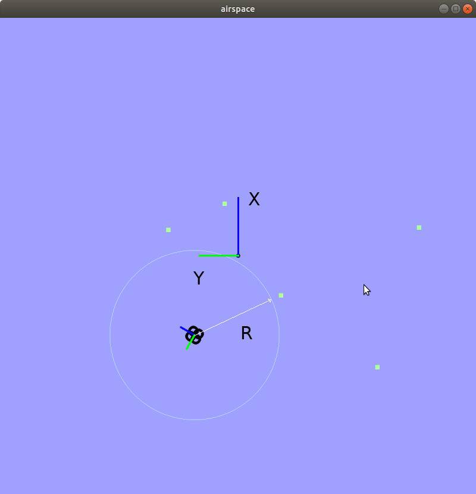

Quiz 3
======

In both quizzes DO NOT CHANGE ANY OF THE EXISTING function declarations. You can add other private functions, but your code will only be tested against the currently defined public functions.

Part A
------

**PREAMBLE**

We have been provided a basic 2D drone simulator  which encompasses a radar sensor on the drone (the quadcopter). While drones can move in 3D, here we are only concerned with a 2D representation `Pose`: x,y and yaw.

In the image below we show the "world" coordinate system defined at the base station (centre of image, at X=0 Y=0). Coordinate system axis uses right hand rule. The angle *yaw* is from X towards Y axis (towards Y is positive), yaw is between -PI to PI. 

The radar is at the centre of our aircraft (at the `Pose` of the aircraft) and obtains measurements: range `R` and bearing `theta` from quadcopter `Pose` to all enemy stationary targets. In the simulation you will see the effect of radar propagating further away, when the enemy is detected the white circle that depicts the radar beam will turn black and will report the R and theta to the target. 

Refer to class [Display](./a1/dep/include/display.h) for the functionality provided with the simulator. The `Display` class allows us to select a number of `bogies` to be randomly spawned in the `Airspace`. We can invoke function `vector<RangeBearingStamped> scan(Pose pose)` in the `Display` class. The `scan` function simulates a radar, based at the centre of the aircraft. The radar is obtaining measurements, range `R` and bearing `theta` from quadcopter `Pose` to all enemy stationary targets returned as a vector of `RangeBearingStamped`.  

We will use `vector<RangeBearingStamped>` measurements and the `Pose` of our aircraft to compute the location of the enemies, x/y in world coordinate frame at the base station and vice-versa. The functions are defined in  [tf2](./a1/tf2.h). 

Further we can use the aircraft pose and enemy location to compute *time to impact*, in the [Analysis Class](./a1/analysis.h). Time to impact is the time it will take the quadcopter to reach the stationary enemies.

Finally, we can create a graph connecting all enemies, with an enemy position as edges of the graph and the edge weight being distance between the enemies.

**TASK 1 - Local to Global Conversion**

The radar obtains range and bearing readings (polar coordinates) from the `Pose` supplied in `vector<RangeBearingStamped>`. Convert these measurements into Cartesian locations relative to (0,0) at the base station location. 

**TASK 2 - Global to Local Conversion** 

If the enemy information was relative to (0,0) - the origin of the map (aka the base station location) and the `Pose` of friendly supplied, compute the range and bearing of the bogie in the reference frame of the quadcopter. This is the exact opposite operation of TASK 1 above. 

**TASK 3 - Time to Impact**

For an quadcopter to reach any of the goals it will need to obey the constraints max linear velocity V_MAX=1.0 m/s which is the total velocity (can be distributed to forward/backward) and max angular velocity OMEGA_MAX=1.0 rad/s (turning left/right). 

Unlike Assignment 1, here we are required to progress towards the target facing it directly (it should appear on the X axis of the quadcopter) so we could hypothetically observe it with a camera mounted along X axis of the quadcopter). 

To reach any of the goals in the quickest time we can compute time to impact as a combination of (1) theoretically fastest turn maximum angular velocity on the spot and (2) fastest speed - maximum linear velocity.

Implement the function that computes the time to impact for each of the targets (enemy) for the pose supplied (aircraft pose).

**TASK 4 - Create Graph**

Creates a graph of all goals (where goals are all nodes of the graph). All goals are interconnected (i.e. if number of nodes is N then each node is connected to N-1 nodes and therefore has N-1 edges).  Store graph using the `AdjacencyList` supplied in e [Analysis Class](./a1/analysis.h).  

In the graph, the outer vector contains an entry for all nodes (like our Week 5 BFS/DFS example). The inner vector has edges a pair, where the pairs contain (1) a metric (we will use Euclidean distance between the nodes) - as first element (2) the node id the edge is connecting to - as second element

Part B
--------------------

**PREAMBLE**

You have been provided a library that implements a [Radar](./a2/dep/radar.h) sensor. The  header file describes the public functions available in  [Radar](./a2/dep/radar.h). The library is compiled, as such you only have the header file and the dynamic library.

The radar has been designed to cater for two possible max distances and this results in two scanning speeds, scanning speed is related to the maximum distance we want the radar to detect targets (the radar in effect has to wait for an echo fro a target to compute distance). The documentation for the sensor has no indication of the two scanning speeds, while the available distance settings are in the header file. Our goal is to empirically determine the scanning speed with our code and the use of threads.

We will use the fact that the radar has a start function, which kicks off a thread inside the radar that continuously obtains radar data. We have created a thread that will run a function `computeScanningSpeed` and this function will gather a number of samples from the radar and use the time taken to get this number of samples. The scanning speed would therefore be the total time taken to get the samples, divided by the number of samples acquired (It is better to get the time as an average value over the number of samples so choose **samples = 100**) . For timing we can use chrono that comes with C++11 as allows to determine a duration that from two times, [refer to this example for using chrono](https://en.cppreference.com/w/cpp/chrono/steady_clock/now)

**TASK 1 - Determine Scanning time for the shorter max distance setting**

Set the max distance for the radar to shorter distance, implement `computeScanningSpeed`

**TASK 2 - Determine Scanning time for the longer the max distance setting**

Set the max distance for the radar to longer distance, check your implementation of `computeScanningSpeed`

