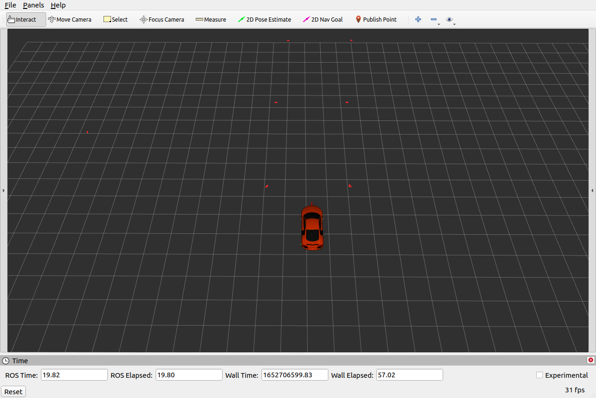
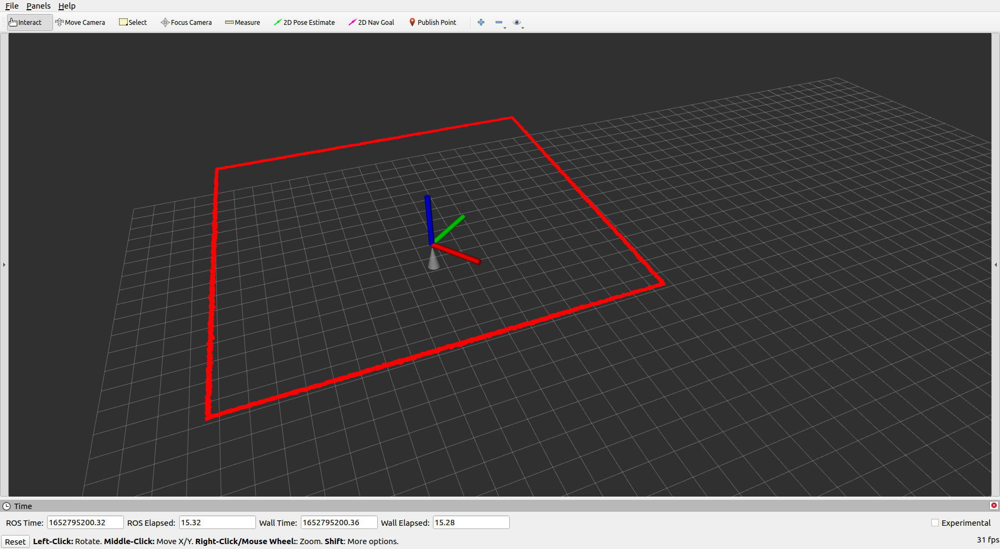

Quiz 5
======

General Information
------
To develop the quiz  symbolically link the [quiz5 folder](.) to your catkin_ws/src (ie if your quiz5 folder path is <git_repo_path>/quizzes/quiz5/) execute:

```bash
cd ~/catkin_ws/src
ln -s <git_repo_path>/quizzes/quiz5/
```
Compile with catkin_make, tests are compiled with `catkin_make tests` **NOTE plural in tests** 

```bash
cd ~/catkin_ws
catkin_make
catkin_make tests
```


Part A1
------

In ROS to test our code we can supply a rosbag (a collection of data) that we have recorded and know "ground truth". To examine the rosbag that has been supplied for quiz5 a1  open a terminal and go to the bag folder using `roscd quiz5_a1/test/bag/`.  Play the bag using `rosbag play -r 0.1 --clock -l sample.bag` .  To view the data after playing use `rviz -d $(rospack find gazebo_tf)/rviz/ugv_a3.rviz`. You might not have the vehicle appear (but you will have the coordinate system of the vehicle shown as an axis). The laser readings are in red, for a cone on the track we have a number of readings, the car shoudl drive in between the cones. In below figure we have 7 cones (6 are directly in front of the vehicle.)

 




The task is to process laser data and extract useful information about the environments around us, RVIZ displays them in red.

All of your programming will be in the [LaserProcessing Class](./a1/src/laserprocessing.h). This class is called from  Detection class, but we can also unit tests it independently by providing data for which we know the "ground truth", the exact output we are expecting.  To compile your unit tests `catkin_make tests`  (this command ONLY works from within catkin_ws folder). To run your your unit tests `rosrun quiz5_a1 quiz5_a1_test`

**TASK 1 - Count Object Readings**

Count number of laser readings that belong to objects (are not infinity, nan or at max range).

As a reminder `rosmsg info sensor_msgs/LaserScan` will show you the `LaserScan` message, you will note that ranges and intensities are vectors and for each range you have the corresponding intensity at same location in the corresponding vector. Refer week 11/12 for examples of working with LaserScan data.

**TASK 2 - Count Number of Segments**

Segments are formed by consecutive laser readings that are less than 0.3m apart from each other (the Euclidian distance between successive points <0.3 ). The example image above has 7 segments.

**TASK 3 - Return Position of Closest Cone**

The position should be the location of the closest cone, we can leverage the segments that we computed in TASK 3. Each of those segments is a number of readings that belong to one cone. Use the mean of the points to compute the location of the cone.

**TASK 4 - Detect Road Centre**

Detect two cones, that are closest together, and on either side of the road, the road is ~8m wide. The road centre is the in the middle of the two cones which are either side of road.  Use the rviz **Publish Point** tool and the `/clicked_point` topic that was discussed in week 12 to evaluate your code in detecting the cones and validating your code.


## Part A2

In ROS to test our code we can supply a rosbag (a collection of data) that we have recorded and know "ground truth". To examine the rosbag that has been supplied for quiz5 a1  open a terminal and go to the bag folder using `roscd quiz5_a2/test/bag/`.  Play the bag using `rosbag play -r 0.1 --clock -l sample1.bag`  (or `sample2.bag`)  To view the data after playing use `rviz -d $(rospack find gazebo_tf)/rviz/uav_a3.rviz`. You might not have the drone appear (but you will have the coordinate system of the vehicle shown as an axis). The laser readings are in red, and the sonar a single cone reading)

 




The task is to process laser data and extract useful information about the environments around us.

All of your programming will be in  [RangeProcessing ](./a2/src/rangeprocessing.h). This file has two functions in the `range_processing` namespace. The functions are called from  Detection class, but we can also unit tests it independently by providing data for which we know the "ground truth", the exact output we are expecting.  To compile your unit tests `catkin_make tests`  (this command ONLY works from within catkin_ws folder). To run your your unit tests `rosrun quiz5_a2 quiz5_a2_test`

**TASK 1 - Detect Height of Object**

Return height of object below the quadcopter (the pose of quadcopter is provided)

The height is indicated by the lengt/height of the cone (we need to use the position of the drone (which is also the pose of the sensor)  and the range to compute the height of whataever is under the drone (heigth from ground)

As a reminder `rosmsg info sensor_msgs/Range` will show you the `Range` message.

**TASK 2 - Position of Person**

Return position of person below the quadcopter (the pose of quadcopter is provided), return position of the top of the persons head. The person is below the quadcopter (the pose of quadcopter is provided). The position should be the position of quadcopter in x,y and in z we need to use the height of the person supplied. In essenc, given we know how high a person should be, we can discriminate a person from a wall (and a wall could be picked up in TASK 1).