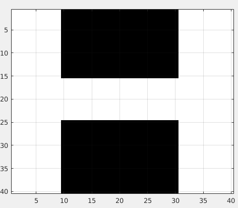
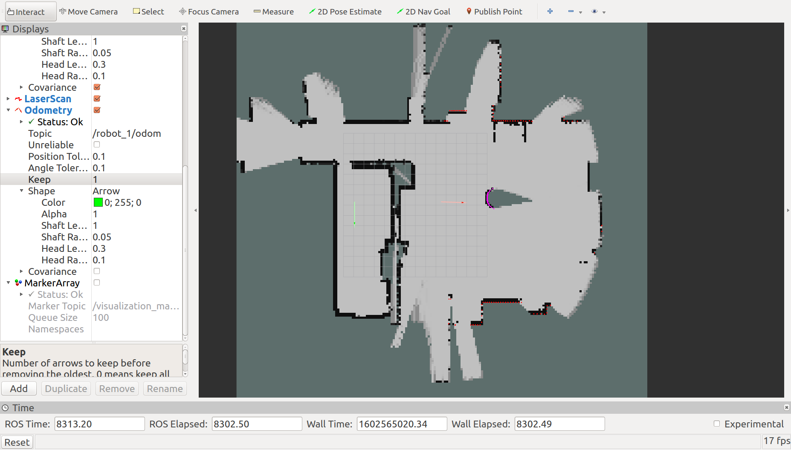

Week 11 Tutorial Questions
=========================

Work through these questions and make sure you understand what is going on in each example. 
If you have any questions about the material, please raise them in the next lab session.

This week's lab questions will make use of the pfms_support package provided to assist you with assignment 3.

Before you get started, make sure you do the following:

* Check out the latest code from the repository
* Link the `services_masterclass` folder to your catkin workspace, (ie if your path is <YOURGIT>/tutorial/week11/starter/services_masterclass then execute:
```bash
cd ~/catkin_ws/src
ln -s <YOURGIT>/tutorial/week11/starter/services_masterclass
```

* Compile packages using `catkin_make` and compile tests using `catkin_make tests`
```bash
cd ~/catkin_ws
catkin_make
```

* Compile tests using `catkin_make tests`  ... there is an *s* at the end of tests!
```bash
cd ~/catkin_ws
catkin_make tests
```

The focus of exercises 1-3 is in unit testing the [GridProcessing] class that we have developed. This class should enable checking connectivity between an origin and destination point supplied in robot coordinates (in meters). By connectivity, we test whether a straight line between the origin and destination will solely go over free space in OccupancyGrid (the line only crosses free space, which is not occupied). 

We test with extensive unit tests  with simulated and real occupancy grid maps [utest.cpp]. Then, when happy with the functioning of this code, we will incorporate it into our ROS node and use it in a service as well as in a separate thread.


Ex01: GoogleTest in ROS (Unit Testing)
----------------------------

The week11 package defines some unit tests and compiles a test executable called `week11-test`. You can find the unit tests itself as in [utest.cpp](./starter/services_masterclass/test/utest.cpp)

Unit tests are generally performed on libraries, code that is well defined and is often isolated from the ROS framework of topics / services.  **You should NOT have code with callbacks being tested**. You can opt to have different constructors that allow various forms of integration.

In this case we have a [GridProcessing](./starter/services_masterclass/src/grid_processing.h) class that is compiled into a library and thereafter used within the ROS framework.

The test cases are done in isolation from topics/subscribers. We create a GridMap with a particular appearance, or load a GridMap and test.

It is the nature of unit tests, that the answer is known for the test, checking the function for a variety of situations with known answers. 

You can run tests 
```bash
rosrun week11 week11_test
```

Your TASK is to:
* Create an OgMap for testing that looks like sample OgMap below
* Add to the tests, with a test that succeeds and one that fails on your OgMap



REMEMBER: The grid is a [row-major](starter/services_masterclass/test/utest.cpp).

Ex02: GoogleTest in ROS (Unit Testing) 
----------------------------

There is a second test that we have developed, it uses a saved bag that we analyse in the test.
This way, we can have a realistic OgMap image with areas of free space, unknown space, and occupied space. It's best (simpler) if you have a single OgMap available in bag, to test against One Map. 

To examine the bag, we can go to the location of bag folder by executing `roscd week11/test/samples/`

You can check the status of the bag (data inside) by `rosbag info sample.bag `, where `sample.bag` is the bag name (you can renames bags just like any file).
```
path:        sample.bag
version:     2.0
duration:    0.8s
start:       Jan 01 1970 11:24:51.20 (5091.20)
end:         Jan 01 1970 11:24:52.00 (5092.00)
size:        376.6 KB
messages:    120
compression: none [1/1 chunks]
types:       nav_msgs/OccupancyGrid [3381f2d731d4076ec5c71b0759edbe4e]
             nav_msgs/Odometry      [cd5e73d190d741a2f92e81eda573aca7]
             tf2_msgs/TFMessage     [94810edda583a504dfda3829e70d7eec]
topics:      /local_map/local_map     8 msgs    : nav_msgs/OccupancyGrid
             /robot_0/odom            9 msgs    : nav_msgs/Odometry     
             /tf                    103 msgs    : tf2_msgs/TFMessage     (5 connections)
```

You can also play the bag back, `rosbag play -r 0.1 -l --clock sample.bag --pause`, this is playing `sample.bag` at `-r 0.1` 0.1 of real time `-l` looping in circles `--clock` with the clock being published `--pause` and will start in pause mode.
You can single step or play continuously via `s` key or `SPACE` that toggles between playing and being paused.

In rviz if started with `rviz -d $(rospack find project_setup)/rviz/pfms.rviz ` you will have following image



Your TASK is to:
* Add to the existing unit test, with tests for success and failure on your current OgMap (Adjust the GridSize to assist you in developing the test and selecting origin and destination point).
* You can click on a point in the map using `Publish Point` and is you `rostopic echo /clicked_point` you will see the points you click.


Ex03: GoogleTest in ROS (Unit Testing) 
----------------------------

To capture another rosbag you need to terminate playing current bag and launch the simulation `roslaunch project_setup project_setup.launch`.
You can not have both a bag playing and a simulation running, as the topics overwrite each other.

First, check the topics available using `rostopic list`

You may have all of below
```
/clicked_point
/clock
/initialpose
/local_map/local_map
/local_map/local_map_updates
/move_base_simple/goal
/robot_0/base_pose_ground_truth
/robot_0/base_scan
/robot_0/cmd_vel
/robot_0/odom
/robot_1/base_pose_ground_truth
/robot_1/base_scan
/robot_1/cmd_vel
/robot_1/odom
/robot_2/base_pose_ground_truth
/robot_2/base_scan
/robot_2/cmd_vel
/robot_2/odom
/rosout
/rosout_agg
/tf
/tf_static
/visualization_marker
```

Select the ones you wish to record. I'm recording the robot's poses, the ogmap, and the transforms (the last two are to enable visualisation in rviz as well and the laser on robot_0)
```
rosbag record -l 1 /robot_0/odom /local_map/local_map /tf /tf_static /robot_0/base_scan
```

Your TASK is to:
* Write a new unit test, and within it, one test that succeeds and one that fails on the OccupancyGrid map you just saved.

Ex04: Using Services in ROS - Checking if a Point is Reachable
----------------------------

In the `week11` node and the `PfmsSample` class, we *advertise* a service named `face_goal` with the type `project_setup::FaceGoal`.
The pose supplied on this request has a pose (x and y value).

TASK: Adjust the code so it returns a `true` in the acknowledgement of the service call if the point can be reached in a **straight line** from the current robot pose, only traversing free space.

To call the service
```bash
rosservice call /face_goal "pose:
  x: 0.0
  y: 0.0
  theta: 0.0"
```

Use the `GridProcessing` class we have developed for this task. 


Ex05: Using our GridProcessing Class in a separate thread 
----------------------------

We need to check whether the requested point can be reached every 5 seconds. What information do we need for this task? How do we obtain it?

We should also visualise that the point can be reached (or not) by publishing a marker (sphere), colour it green if it can be reached and red otherwise.


[services_masterclass]: starter/services_masterclass
[utest.cpp]: starter/services_masterclass/test/utest.cpp
[GridProcessing]: starter/services_masterclass/grid_processing.h
[quiz5a]: ../../quizzes/quiz5/a
[pfms_support]: ../../skeleton/pfms_support
